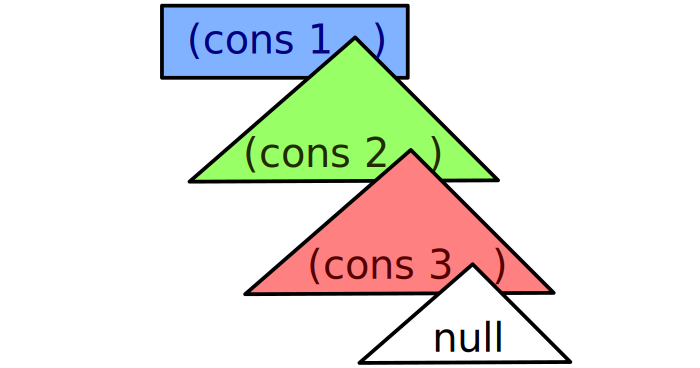

## Intro

Scheme is

* simple,
* weird, and
* cool

## Simple

Scheme is simple by design.

* Designed for teaching^[by Sussman and Steele, 1970s]
* Used as the basis of the Computer Science course at MIT
* Based on Lambda Calculus^[Alonzo Church, 1930]

## Simple to try

```bash
$ sudo apt install racket
$ mzscheme
>
```

## Simple to use

Scheme has:

* One thing you can do
* One data structure

Both are actually the same.

## Simple syntax

```scheme
(operator operand1 operand2 ...)
```

## Simple expressions

```scheme
> (+ 3 4)
```

## Simple expressions

```scheme
> (+ 3 4)
7
```

## Simple expressions

```scheme
> (+ 3 4)
7
> (* 3 4)
```

## Simple expressions

```scheme
> (+ 3 4)
7
> (* 3 4)
12
```

## Simple expressions

```scheme
> (+ 3 4)
7
> (* 3 4)
12
> (+ 5 (* 2 2))
```

## Simple expressions

```scheme
> (+ 3 4)
7
> (* 3 4)
12
> (+ 5 (* 2 2))
9
```

## Simple definitions

```scheme
> (define foo 3)
```

## Simple definitions

```scheme
> (define foo 3)

> foo
```

## Simple definitions

```scheme
> (define foo 3)

> foo
3
```

## Simple definitions

```scheme
> (define foo 3)

> foo
3
> (* foo 4)
```

## Simple definitions

```scheme
> (define foo 3)

> foo
3
> (* foo 4)
12
```

## Simple functions

```scheme
> (define (square x) (* x x))
```

## Simple functions

```scheme
> (define (square x) (* x x))

> (square 4)
```

## Simple functions

```scheme
> (define (square x) (* x x))

> (square 4)
16
```

## Simple functions

```scheme
> (define (square x) (* x x))

> (square 4)
16
> (+ (square 2) (square 3))

```
## Simple functions

```scheme
> (define (square x) (* x x))

> (square 4)
16
> (+ (square 2) (square 3))
13
```

## Simple flow control

```scheme
(define (abs x)
        (if (< x 0)
            (- x)
            x))
```

## Simple flow control

```scheme
(define (abs x)
        (if (< x 0)
            (- x)
            x))

> (abs -3)
```

## Simple flow control

```scheme
(define (abs x)
        (if (< x 0)
            (- x)
            x))

> (abs -3)
3
```

## Simple flow control

```scheme
(define (abs x)
        (if (< x 0)
            (- x)
            x))

> (abs -3)
3
> (abs 3)
```

## Simple flow control

```scheme
(define (abs x)
        (if (< x 0)
            (- x)
            x))

> (abs -3)
3
> (abs 3)
3
```

## Simple data structure

```scheme
> (list 9 3 5)
```

## Simple data structure

```scheme
> (list 9 3 5)
(9 3 5)
```

## Simple data structure

```scheme
> (list 9 3 5)
(9 3 5)
> (sort (list 9 3 5) <)
```

## Simple data structure

```scheme
> (list 9 3 5)
(9 3 5)
> (sort (list 9 3 5) <)
(3 5 9)
```

## Simple data structure

```scheme
> (list 9 3 5)
(9 3 5)
> (sort (list 9 3 5) <)
(3 5 9)
> (length (list 3 2))
```

## Simple data structure

```scheme
> (list 9 3 5)
(9 3 5)
> (sort (list 9 3 5) <)
(3 5 9)
> (length (list 3 2))
2
```

## Weird

Scheme is weird.

* Building lists from pairs
* Recursion for everything
* Passing functions into functions
* Data/code duality

## Weird lists

```scheme
> (define x (list 1 2 3))
```

## Weird lists

```scheme
> (define x (list 1 2 3))

> (car x)
```

## Weird lists

```scheme
> (define x (list 1 2 3))

> (car x)
1
```

## Weird lists

```scheme
> (define x (list 1 2 3))

> (car x)
1
> (cdr x)
```

## Weird lists

```scheme
> (define x (list 1 2 3))

> (car x)
1
> (cdr x)
(2 3)
```

## Weird pairs

```scheme
> (cons "a" "b")
```

## Weird pairs

```scheme
> (cons "a" "b")
("a" . "b")
```

## Weird pairs

```scheme
> (cons "a" "b")
("a" . "b")
> (cons (cons 5 6) 7)
```

## Weird pairs

```scheme
> (cons "a" "b")
("a" . "b")
> (cons (cons 5 6) 7)
((5 . 6) . 7)
```

## Weird pairs

```scheme
> (cons "a" "b")
("a" . "b")
> (cons (cons 5 6) 7)
((5 . 6) . 7)
> (define p (cons 1 2))
```

## Weird pairs

```scheme
> (cons "a" "b")
("a" . "b")
> (cons (cons 5 6) 7)
((5 . 6) . 7)
> (define p (cons 1 2))

> (car p)
```

## Weird pairs

```scheme
> (cons "a" "b")
("a" . "b")
> (cons (cons 5 6) 7)
((5 . 6) . 7)
> (define p (cons 1 2))

> (car p)
1
```

## Weird pairs

```scheme
> (cons "a" "b")
("a" . "b")
> (cons (cons 5 6) 7)
((5 . 6) . 7)
> (define p (cons 1 2))

> (car p)
1
> (cdr p)
```

## Weird pairs

```scheme
> (cons "a" "b")
("a" . "b")
> (cons (cons 5 6) 7)
((5 . 6) . 7)
> (define p (cons 1 2))

> (car p)
1
> (cdr p)
2
```

## Weird list-building

```scheme
> null
```

## Weird list-building

```scheme
> null
()
```

## Weird list-building

```scheme
> null
()
> (cons 2 null)
```

## Weird list-building

```scheme
> null
()
> (cons 2 null)
(2)
```

## Weird list-building

```scheme
> null
()
> (cons 2 null)
(2)
> (cons 1 (cons 2 null))
```

## Weird list-building

```scheme
> null
()
> (cons 2 null)
(2)
> (cons 1 (cons 2 null))
(1 2)
```

## Weird list-building

```scheme
> null
()
> (cons 2 null)
(2)
> (cons 1 (cons 2 null))
(1 2)
> (list 1 2)
```

## Weird list-building

```scheme
> null
()
> (cons 2 null)
(2)
> (cons 1 (cons 2 null))
(1 2)
> (list 1 2)
(1 2)
```

## Weird lists made of pairs

\ 

```scheme
(list 1 2 3)
```

## Weirdly named functions

* `cons` sticks things together
* `car` gives you the first thing
* `cdr` gives you the second thing

## Weirdly named functions

* `cons` sticks things together
* `car` gives you the "head"
* `cdr` gives you the "tail"

## Weirdly named functions

* So `cdadar`'s meaning should be obvious

## Weirdly named functions

* So `cdadar`'s meaning should be obvious
* Right?

## Weirdly named functions {.fragile}

From the manual:

```{emphasize=1:3-1:6,2:11-2:11,2:16-2:16,2:21-2:21,2:26-2:26}
(cdaddr v)
Returns (cdr (car (cdr (cdr v))))
```

## Weird recursion

```scheme
(define (sum vs)
        (if (= 1 (length vs))
            (car vs)
            (+ (car vs)
               (sum (cdr vs)))))
```

## Weird recursion

```scheme
(define (sum vs)
        (if (= 1 (length vs))
            (car vs)
            (+ (car vs)
               (sum (cdr vs)))))

> (sum (list 5 6 7))
```


## Weird recursion

```scheme
(define (sum vs)
        (if (= 1 (length vs))
            (car vs)
            (+ (car vs)
               (sum (cdr vs)))))

> (sum (list 5 6 7))
18
```

## Weird recursion {.fragile}

```{emphasize=1:10-1:12,5:17-5:19}
(define (sum vs)
        (if (= 1 (length vs))
            (car vs)
            (+ (car vs)
               (sum (cdr vs)))))
```

## Weird recursion {.fragile}

```{emphasize=3:14-3:17,5:22-5:24}
(define (sum vs)
        (if (= 1 (length vs))
            (car vs)
            (+ (car vs)
               (sum (cdr vs)))))
```

## Weird meta-functions

```scheme
(define (double value)
        (* 2 value))

(define (apply-twice fn value)
        (fn (fn value)))

> (apply-twice double 2)
```

## Weird meta-functions

```scheme
(define (double value)
        (* 2 value))

(define (apply-twice fn value)
        (fn (fn value)))

> (apply-twice double 2)
8
```

## Weird meta-functions {.fragile}

```{emphasize=1:22-1:23,2:10-2:11,2:14-2:15}
(define (apply-twice fn value)
        (fn (fn value)))
```

## Weird functions as values

```scheme
> (map double (list 3 4 5))
```

## Weird functions as values

```scheme
> (map double (list 3 4 5))
(6 8 10)
```

## Weird code as data

```scheme
> (define s (list '+ 4 7))
```

## Weird code as data

```scheme
> (define s (list '+ 4 7))
> s
```

## Weird code as data

```scheme
> (define s (list '+ 4 7))
> s
(+ 4 7)
```

## Weird code as data

```scheme
> (define s (list '+ 4 7))
> s
(+ 4 7)
> (eval s)
```

## Weird code as data

```scheme
> (define s (list '+ 4 7))
> s
(+ 4 7)
> (eval s)
11
```

## Weird code as data

```scheme
> (define (switchop a) (cons '* (cdr a)))
```

## Weird code as data

```scheme
> (define (switchop a) (cons '* (cdr a)))
> (define s2 (switchop s))
```

## Weird code as data

```scheme
> (define (switchop a) (cons '* (cdr a)))
> (define s2 (switchop s))
> s2
```

## Weird code as data

```scheme
> (define (switchop a) (cons '* (cdr a)))
> (define s2 (switchop s))
> s2
(* 4 7)
```

## Weird code as data

```scheme
> (define (switchop a) (cons '* (cdr a)))
> (define s2 (switchop s))
> s2
(* 4 7)
> (eval s2)
```

## Weird code as data

```scheme
> (define (switchop a) (cons '* (cdr a)))
> (define s2 (switchop s))
> s2
(* 4 7)
> (eval s2)
28
```

## Cool

* Quoting
* Better names
* Duck typing (generics)
* Lambdas & Closures
* Metaprogramming

## Cool quoting

```scheme
> '(* 3 6)
```

## Cool quoting

```scheme
> '(* 3 6)
(* 3 6)
```

## Cool quoting

```scheme
> '(* 3 6)
(* 3 6)

> '(foo (bar "a" 3))
```

## Cool quoting

```scheme
> '(* 3 6)
(* 3 6)

> '(foo (bar "a" 3))
(foo (bar "a" 3))
```

## Cool names

* These are all valid names in Scheme:

```scheme
equal?
boom!
a*b
co-ordinates
<10
+
```

This is cool.

## Cool replacement

* This works:

```scheme
> (define (+ x y) 5)
> (+ 2 2)
5
```

This is cool.

## Cool Duck Typing

```scheme
> (sort (list 5 4 3 2 1) <)
(1 2 3 4 5)
> (sort (list "abc" "a" "ab") string<?)
("a" "ab" "abc")
```

This is somewhat uncool, but useful.

## Cool lambdas {.fragile}

```{emphasize=2:8-2:27}
> (map
       (lambda (x) (+ x 1))
       (list 1 2 3))
(2 3 4)
```

## Cool closures

```scheme
(define (counter)
        (define c 0)
        (lambda ()
                (set! c (+ c 1))
                c))
```

## Cool closures {.fragile}

```{emphasize=4:18-4:21}
(define (counter)
        (define c 0)
        (lambda ()
                (set! c (+ c 1))
                c))
```

## Cool closures

```scheme
> (define a (counter))
> (a)
```

## Cool closures

```scheme
> (define a (counter))
> (a)
1
```

## Cool closures

```scheme
> (define a (counter))
> (a)
1
> (a)
```

## Cool closures

```scheme
> (define a (counter))
> (a)
1
> (a)
2
```

## Cool closures

```scheme
> (define a (counter))
> (a)
1
> (a)
2
> (a)
```

## Cool closures

```scheme
> (define a (counter))
> (a)
1
> (a)
2
> (a)
3
```

## Cool closures

```scheme
> (define b (counter))
> (b)
```

## Cool closures

```scheme
> (define b (counter))
> (b)
1
```

## Cool closures

```scheme
> (define b (counter))
> (b)
1
> (a)
```

## Cool closures

```scheme
> (define b (counter))
> (b)
1
> (a)
4
```

## Cool metaprogramming

Metaprogramming is just programming.

```scheme
> (define (times-n n) (lambda (x) (* n x)))
```

## Cool metaprogramming

* Build code from code

```scheme
> (define (times-n n) (lambda (x) (* n x)))
> (define times3 (times-n 3))
```

## Cool metaprogramming

* Build code from code

```scheme
> (define (times-n n) (lambda (x) (* n x)))
> (define times3 (times-n 3))
> (define (trpl lst) (map times3 lst))
```

## Cool metaprogramming

* Build code from code

```scheme
> (define (times-n n) (lambda (x) (* n x)))
> (define times3 (times-n 3))
> (define (trpl lst) (map times3 lst))
> (trpl (list 1 2 3))
```

## Cool metaprogramming

* Build code from code

```scheme
> (define (times-n n) (lambda (x) (* n x)))
> (define times3 (times-n 3))
> (define (trpl lst) (map times3 lst))
> (trpl (list 1 2 3))
(3 6 9)
```

## Cool things I haven't mentioned

* Macros
* Streams
* The Metacircular Evaluator

## Cool reading

* *Structure and Interpretation of Computer
  Programs*^[<https://mitpress.mit.edu/sicp/full-text/book/book.html>] changed
  my life

## Questions

This presentation is available under [cc by-sa](http://creativecommons.org/licenses/by-sa/4.0/) at [github.com/andybalaam/videos-scheme-accu2018](https://github.com/andybalaam/videos-scheme-accu2018).

\center \ccbysa

## Extra - data from functions (1)

```scheme
(define (mcons a b)
    (lambda (cmd)
        (if (equal? cmd "car")
            a
            b)))

(define (mcar pair) (pair "car"))
(define (mcdr pair) (pair "cdr"))
```

## Extra - data from functions (2)

```scheme
> (define foo (mcons 1 2))
> (mcar foo)
1
> (mcdr foo)
2
```

## Extra - numbers from functions (1)

```scheme
(define n0 (lambda () null))

(define (minc x) (lambda () x))

(define (mdec x) (x))
```

## Extra - numbers from functions (2)

```scheme
(define n1 (minc n0))
(define n2 (minc n1))
(define n3 (minc n2))
(define n4 (minc n3))
(define n5 (minc n4))
```

## Extra - numbers from functions (3)

```scheme
(define (mzero? x) (null? (x)))

(define (mequal? x y)
    (cond
        ((mzero? x) (mzero? y))
        ((mzero? y) (mzero? x))
        (else (mequal? (mdec x) (mdec y)))))
```

## Extra - numbers from functions (4)

```scheme
> (mequal? n1 n0)
#f
> (mequal? n1 n1)
#t
```

## Extra - numbers from functions (5)

```scheme
(define (m+ x y)
    (if (mzero? y)
        x
        (m+ (minc x) (mdec y))))
```

## Extra - numbers from functions (6)

```scheme
> (mequal? (m+ n0 n2) n2)
#t
> (mequal? (m+ n0 n2) n3)
#f
> (mequal? (m+ n0 n2) (m+ n1 n2))
#f
> (mequal? (m+ n2 n3) n5)
#t
```
